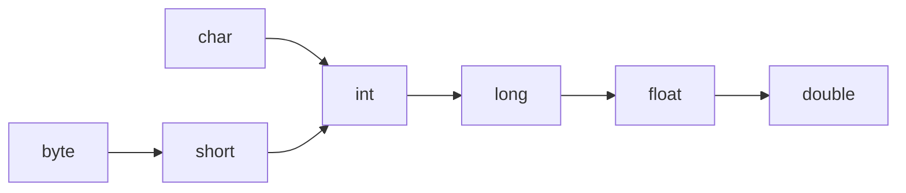

# 阶段1
## 模块1
### 任务1
#### 课程11
java注释规范：
/*	
	项目名称
	项目功能
	作者
	版本
	所有者
	备注
*/
花括号规范：
xxxx {//行末花括号，括号前带空格

	xxxx//括号后空一行
	int age = 18;//运算符前后加空格
}
### 任务2
#### 课程3
初始值：
成员变量的默认值，可以不赋初始值
局部变量必须赋初始值
#### 课程7
变量随使用声明
#### 课程8
基本数据类型：byte short int long float double boolean char
boolean只有true false，输出也是true false
char 长度2字节
自动转换：

### 任务3
#### 课程1
int a,b;//不可读
int a;
int b;//推荐
### 任务4
int operator+(byte ,byte)
因此 a=a+2 报错
但是 a+=2 可以

由于==和=易混淆
==前最好是值而不是变量名
```
outer: for(;;)
	for(;;)
		break outer;
```
break 标号;

switch
支持byte,short,char,int,enum,String
不支持long、float、double、boolean
### 任务5
声明数组
```
int[] arr=new int[20];//[]在类型边上
int[] arr={1,2,3};
X int[] arr=new int[3]{1,2,3};//不行
//数组为初始值
```
arr是指针，数据在堆上

java.util.Arrays
String Arrays.toString(int[])
void Arrays.fill(int[],int)
boolean Arrays.equals(int[],int[])
void Arrays.sort(int[])
int Arrays.binarySearch(int[],int)
1、如果找到关键字，则返回值为关键字在数组中的位置索引，且索引从0开始2、如果没有找到关键字，返回值为负的插入点值，所谓插入点值就是第一个比关键字大的元素在数组中的位置索引，而且这个位置索引从1开始。