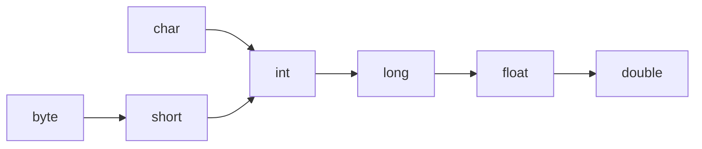
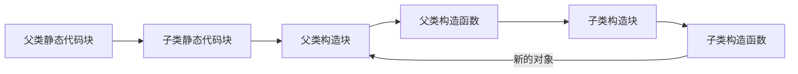

# 阶段1
## 模块1
### 任务1
#### 课程11
java注释规范：
/*	
	项目名称
	项目功能
	作者
	版本
	所有者
	备注
*/
花括号规范：
xxxx {//行末花括号，括号前带空格

	xxxx//括号后空一行
	int age = 18;//运算符前后加空格
}
//方法之间空一行
yyy {

}
### 任务2
#### 课程3
初始值：
成员变量的默认值，可以不赋初始值
局部变量必须赋初始值
#### 课程7
变量随使用声明
#### 课程8
基本数据类型：byte short int long float double boolean char
boolean只有true false，输出也是true false
char 长度2字节
自动转换：

### 任务3
#### 课程1
int a,b;//不可读
int a;
int b;//推荐
### 任务4
int operator+(byte ,byte)
因此 a=a+2 报错
但是 a+=2 可以

由于==和=易混淆
==前最好是值而不是变量名
```
outer: for(;;)
	for(;;)
		break outer;
```
break 标号;

switch
支持byte,short,char,int,enum,String
不支持long、float、double、boolean
### 任务5
声明数组
```
int[] arr=new int[20];//[]在类型边上
int[] arr={1,2,3};
X int[] arr=new int[3]{1,2,3};//不行
//数组为初始值
```
arr是指针，数据在堆上

java.util.Arrays
String Arrays.toString(int[])
void Arrays.fill(int[],int)
boolean Arrays.equals(int[],int[])
void Arrays.sort(int[])
int Arrays.binarySearch(int[],int)
1、如果找到关键字，则返回值为关键字在数组中的位置索引，且索引从0开始
2、如果没有找到关键字，返回值为负的插入点值，所谓插入点值就是第一个比关键字大的元素在数组中的位置索引，而且这个位置索引从1开始。
int[][] arr=new int[2][3];
6个int在堆中
2个int*在堆中
1个int**在栈中
## 模块2
### 任务1
类名首字母大写
成员除第一个单词小写其他首字母大写
存储在堆区
```
class Person{
	String name="AAA";
}
```
可变长参数：
参数数量：0～+oo
可变长参数位于最后
可变长参数类型一样。
void func(int... args){}
//类似int[] args

重载overload，方法名相同，参数列表不同
利用this(xxxx);调用其他构造方法。（必须第一行）
java 自动查找当前目录中其他文件中了类

| 权限    | 类内 | 同包 | 子类 | 不同包非子类 |
| --------- | ---- | ---- | ---------- | ------------ |
| private   | √  | ×   | ×         | ×           |
| default   | √  | √  | ×         | ×           |
| protected | √  | √  | √        | ×           |
| public    | √  | √  | √        | √          |
构造快：
定义在类中，方法外部
在构造方法之前对成员变量初始化
静态代码块：
static 修饰的构造块
类加载的时候执行


java Main aaa bbb
main({"aaa","bbb"})
class Singleton{
	//1.private 构造方法
	//2.受限的getInstance方法
	private Singleton(){}
	private static sin=new Singleton();//推荐
	public static getInstance(){return sin;}
}
用extends继承类
pubilc class Worker extends Person{}
构造方法和私有方法不能继承。私有成员可以被继承，但是不能直接访问。
一个子类只有一个父类。
标注@Override，下面的方法必须是对父类的重写（不然编译器报错）
要求：
1.方法名、参数列表、返回值相同
2.访问权限不能变小
```
Project
└──src
   └──com.lagou.task08(组织域名反写.项目名称信息.模块名称.类名)
	  └──Animal.java
```
导入类、静态成员
```
import static java.lang.System.out; 
```
final修饰的类不能被继承
final修饰的方法不能被重写，可以被继承，可以被重载
final修饰成员=const，在构造块、显示初始化、构造函数都可以初始化
| C++ | Java |
|-----|------|
|虚函数 | 普通函数 |
|纯虚函数 | 抽象函数 |
|抽象类 | 抽象类 |
|虚基类 | 接口 |
抽象方法：abstract修饰的方法。抽象类才有抽象方法。
abstract void xxx();
抽象类：abstract修饰的类。
接口，所有方法都是抽象方法，只能有常量。
允许出现私有方法
允许出现静态方法
```
class A extends D implements B,C {}
interfact A extends B,C;

```
内部类可以也是public
```
Outer o=new Outer();
Outer.Inner i=o.new Inner();
```
外部类.this，是外部类的this指针
局部内部类没有访问修饰符，只在方法体内有效。
局部内部类访问局部变量必须理解为final
匿名内部类
```
Interface inf=new Interface() {
	@Override
	void show(){}
}
```
枚举型构造方法是private，枚举值放在最前面
x.compareTo(y)
=x.ordinal()-y.ordinal()

访问修饰符 @interface xxx{
	public String value() default "xxx";//声明成员变量
}
@xxx(value="hello")
注解没有成员方法。
